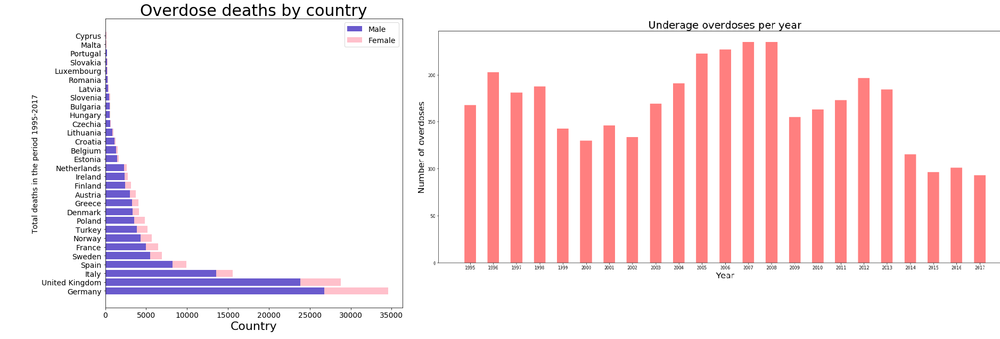
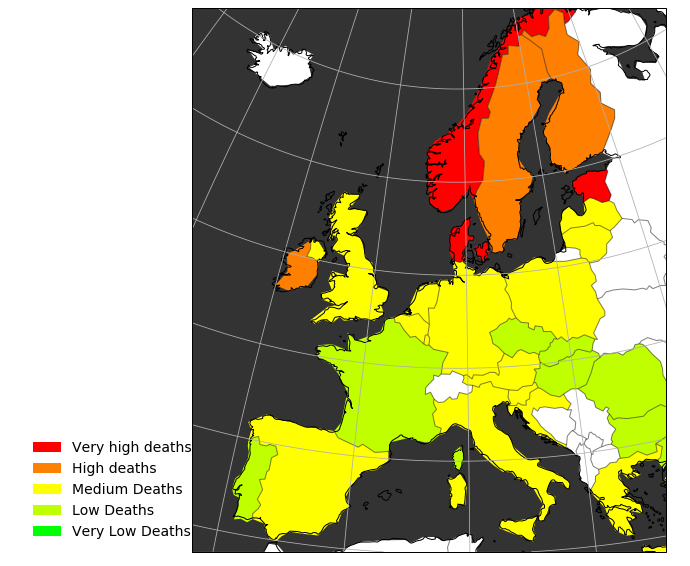
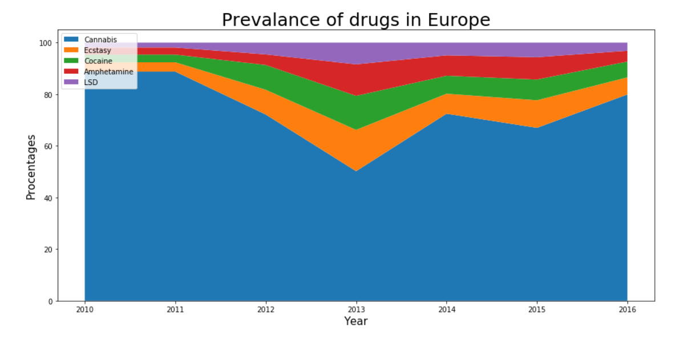
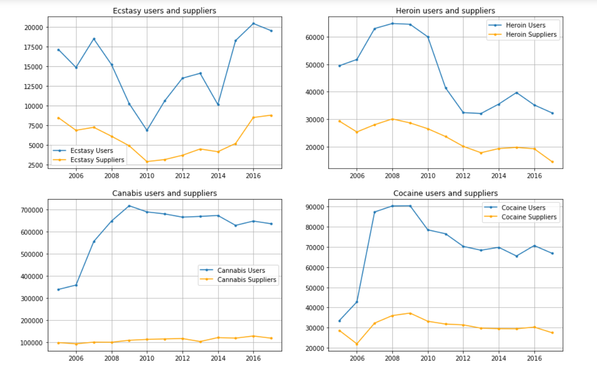
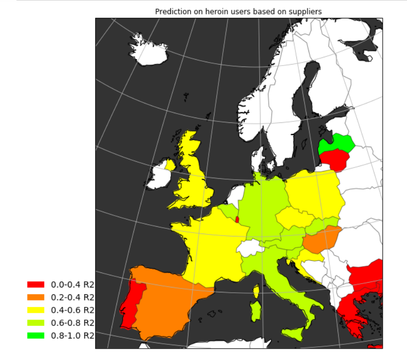
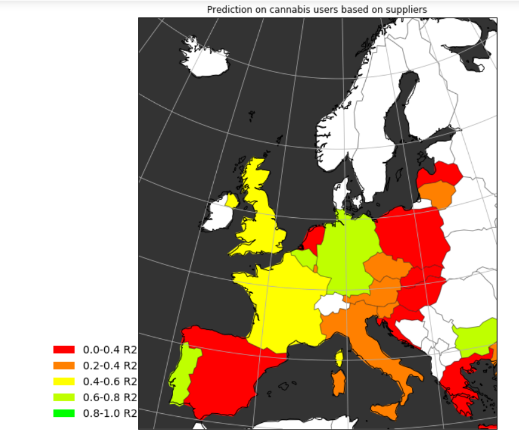
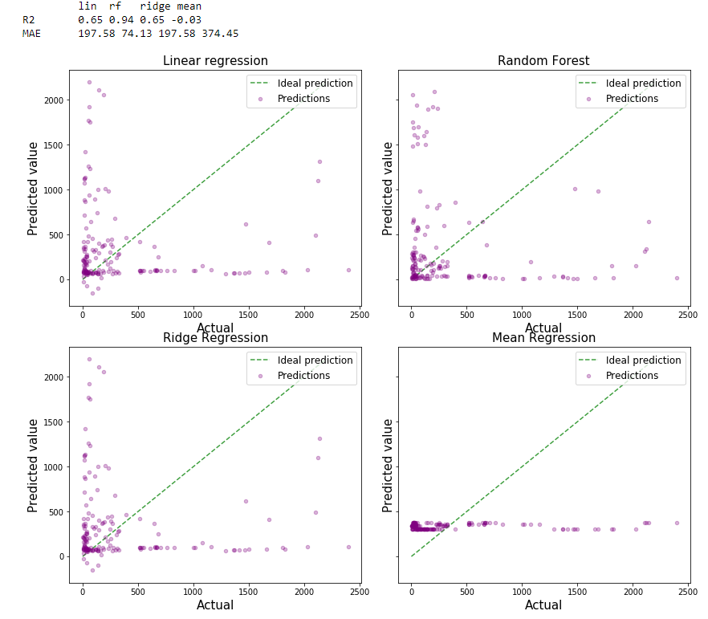
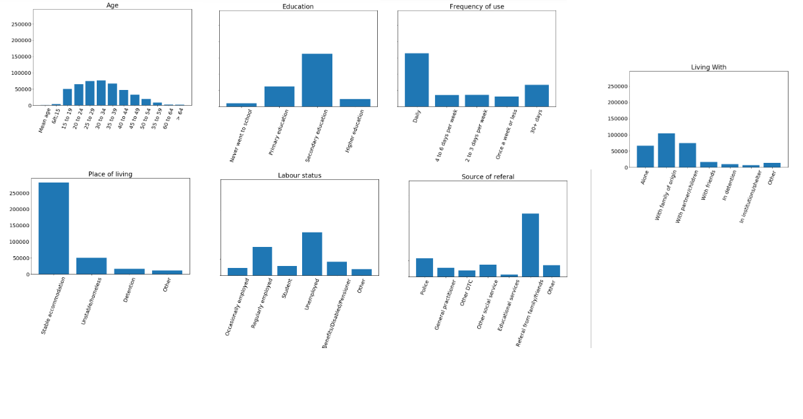
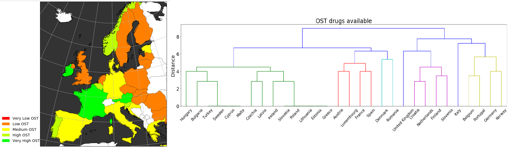
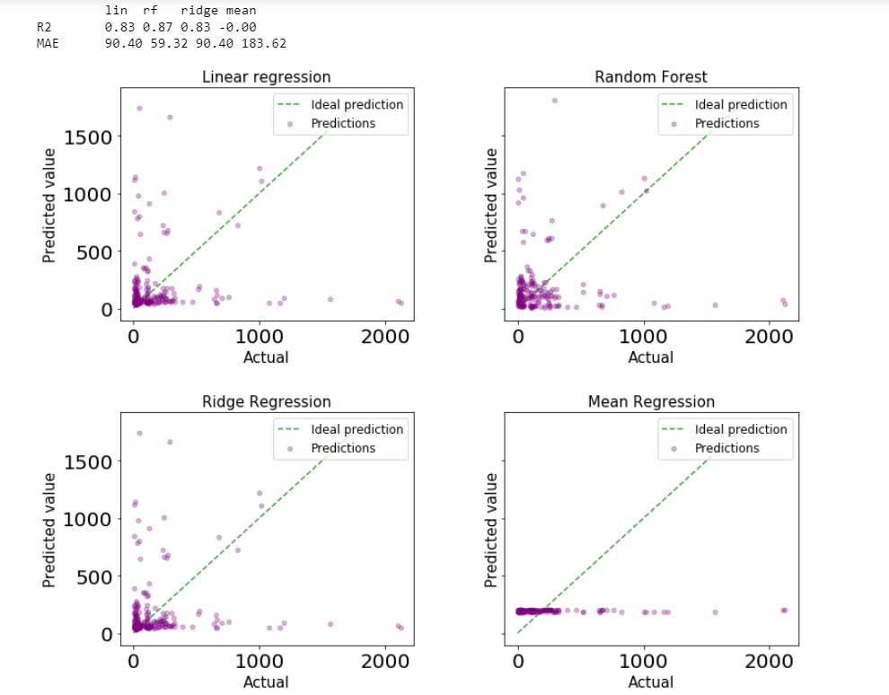

# The drug problem in Europe

## Introduction

A very controversial topic in Europe is the drug problem. With the popularity of the Internet, and the glorification on drugs in social media, drugs are more available than ever. In this report, we want to analyze the data available regarding drugs in Europe, build various prediction models, and better understand the problem.

## Deaths

The most alarming issue, regarding drugs, is the overdose deaths. In the following images we shal look at trends regarding deaths caused by drug overdoses. 

 

## Deaths per 1000 people

On the first chart, we can see that a large majority of overdose deaths are males, and that the three leaders of overdose deaths in 1995-2017 are Germany, UK, and Italy.  On the second graph we can see the underage overdoses - which seem to be fluctuating, with a peak of 2006-2008, and a rapid decrease until 2017 - almost by half since the peak, which is very positive.  

On the third graph we can see that if we look at the relative deaths(per population), countries like UK, Germany and Italy do not stand out as much. The problematic countries seem to be in Scandinavia, plus Estonia and Ireland.

## Drug popularity

We can see that the most popular drug always seems to be cannabis - obviously because of it's legality and availability throughout most of  Europe. However it seems to be decreasing from 2010-2013, and it slowly rises from 2013-2016, but never reaching its' initial dominance in 2010. This is a very worrying trend, since the other drugs listed(Cocaine, Ecstasy, LSD) are much more dangerous than Cannabis.

## Users and suppliers

It is interesting, because we can see almost a symmetrical graph for the users and suppliers, for all of these drugs. So if countries want to reduce the users, they need to find the illegal suppliers. Furthermore, we have constructed regression models for each country to predict the users of a drug, based on the suppliers of it in the country, and other countries. So that we can detect supply chains in Europe.

For all models, it seems that the further away from the central Europe we go, the worse the model - so countries that do not border many countries in Europe have weak models - for example Greece, this indicates that there is not much of a supply chain going on there.The most accurate results are in Germany, which is in the Schengen zone, and bordering 9 countries, so there is a lot of opportunity for drugs to be importer in Europe. The predictors of heroin and ecstasy seem to be more accurate than the ones for cannabis and cocaine(results were so poor I need not show them). If we go back to the Users v suppliers graph, we can obviously see that for cannabis and cocaine the suppliers plots don't seem to be that correlated with the user plots.

## Users and deaths

It is fairly logical that based on the users we can predict the deaths that will occur, so we built a regression model that would look at the users of each drug, and predict deaths based on it. This is the result: 

Random forest seems to perform best - ideally all of the points should be as close to the diagonal as possible(actual = predicted). This is most fulfilled in Random forest.

## Drug treatment

First we will look at some basic statistics regarding people that go to seek treatment:

We can see that most people that undergo treatment are 30-34 years old, have completed only secondary education, consume drugs daily, have stable accomodation, are unemployed, are refered by family and friends, and live with their family. Whatever this means, is up for the reader to decide, but it does not seem optimal.

On the upper image we can see the OST(opioid substitution treatment trends in Europe). As well as the hierarchical clustering of countries based on the availability of an OST drug(there are 8 drugs, that can be available in 6 different ways - so 24 total variables). We can see that France, Austria, Luxembourgh, and Ireland seem to attract the most people into their OST treatment programmes, France is also in the same cluster as Austria and Luxembourgh in the dendogram (the red dendogram seems to yield the best OST results). Countries with low OST seem to be in the green cluster on the dendogram,  and it is bad for countries with a high amount of overdoses(like Sweden and Estonia), to be on the same cluster.

## Drug treatment vs deaths

 

We can see that based on people that undergo treatment for different drugs(such as heroin, cannabis, cocaine etc..), we can quite accurately predict the deaths, therefore if the country wants to limit its' deaths it should concentrate of providing more opioid substitution treatmend to its' people. Random Forest seems to work best, but the other regressors are useful as well.

